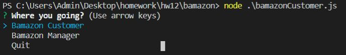
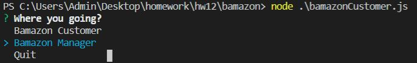

# bamazon

**First select customer**

Select the id of the product you want to buy and how much units

and then this is the result 

**Now manager**

You have this options

**View Products for Sale**
It's going to show you all the products in the database

**View Low Inventory**
It's going to show all the products below 5 units

**Add to Inventory**
It's going to let you add units to a product

**Add New Product**
It's going to let you add a new product to the database

